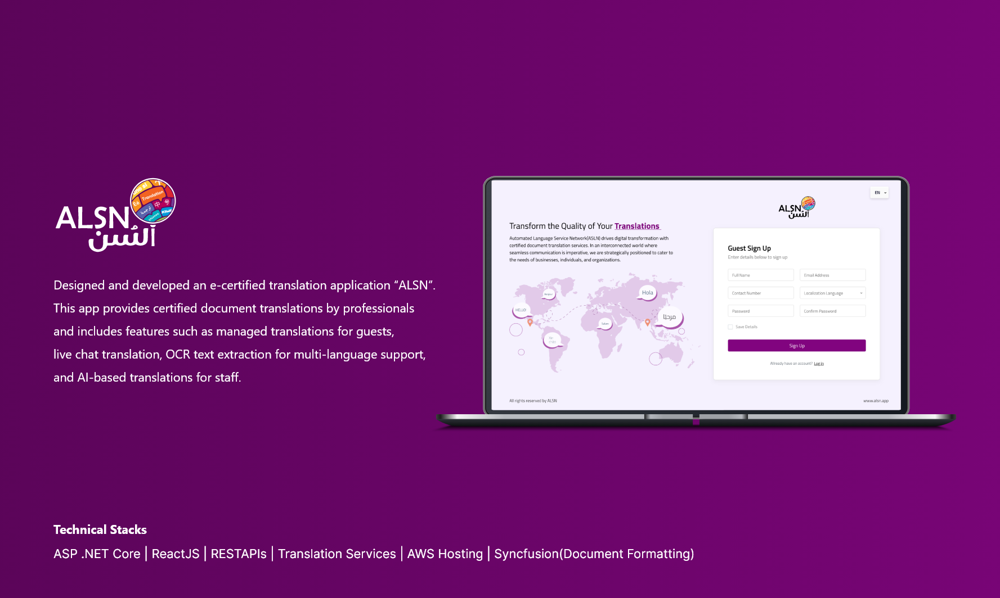
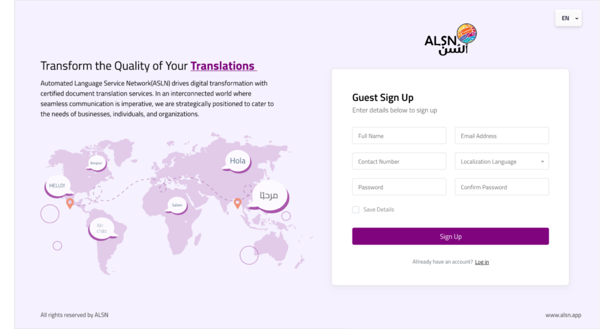
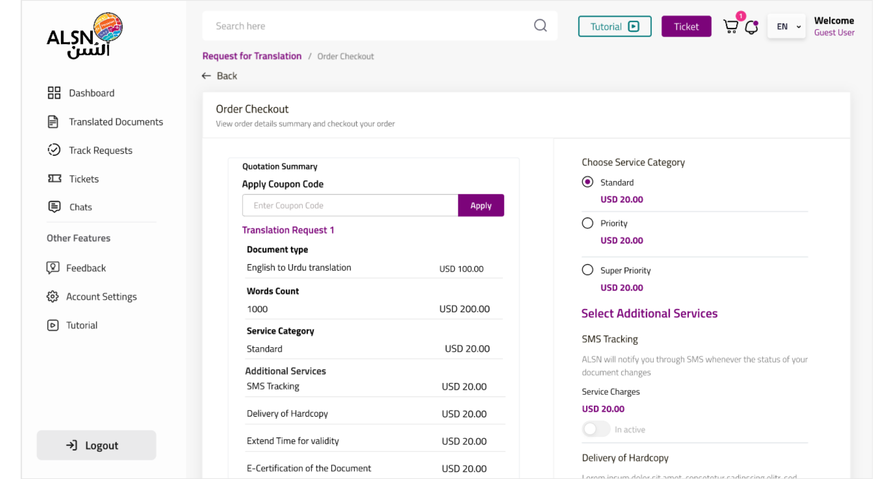
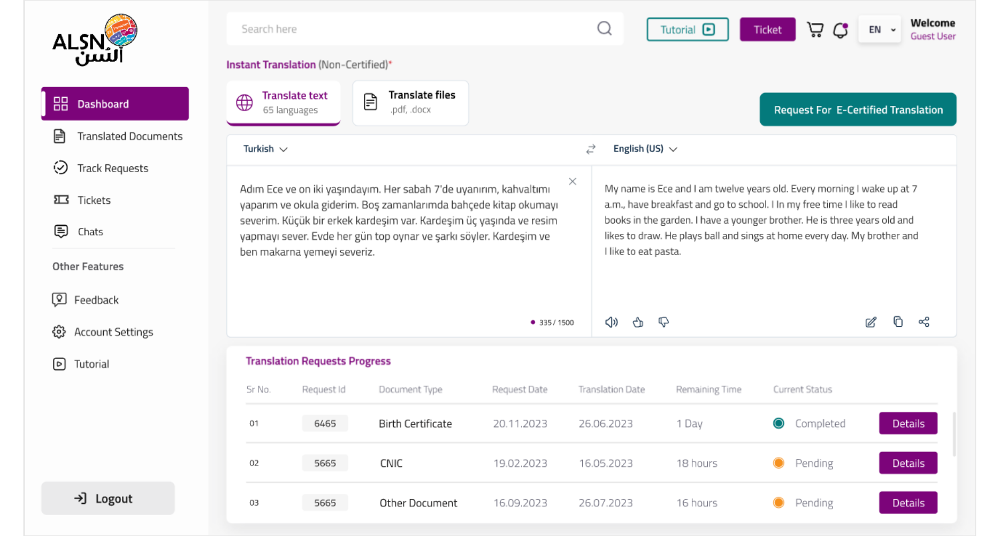
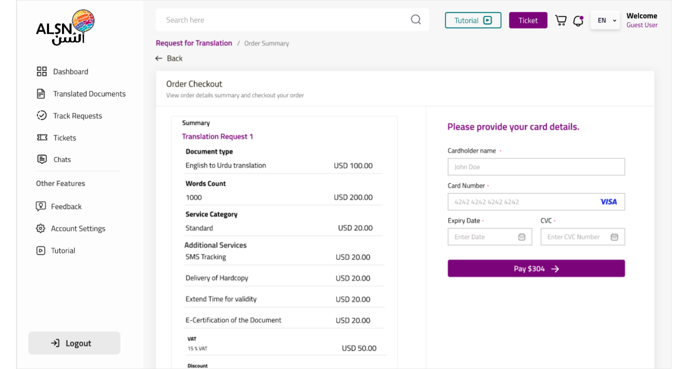
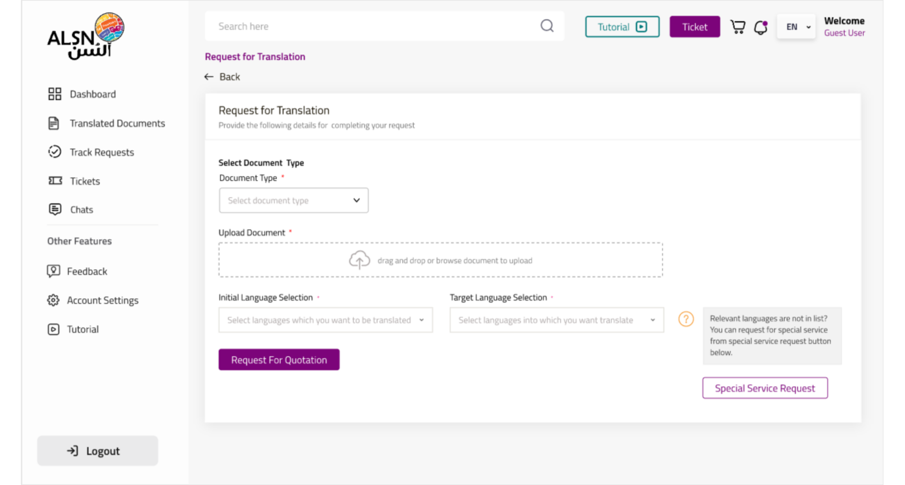

# ALSN

INTRODUCTION

ALSN Translator is a cutting-edge language translation system designed to simplify and elevate your multilingual communication experiences. Whether you need documents translated, real-time chat translations, or instant access to a vast array of languages, ALSN Translator is your trusted companion.

SYSTEM FEATURES

1. In guest portals, users can request document translations, track progress, and chat with translators for clear and quick communication.
2. A translator portal is a hub for professional translators to manage tasks, access task details, and engage in real-time chats for accurate translations.
3. For Translation Offices to efficiently manage orders, oversee translator assignments, control translation statuses, and handle communication seamlessly.
4. Empowering Super Admins with user and role management, application review, financial oversight, ticket resolution, and comprehensive dashboard analytics for system control and optimization.

TECNICALITIES/TOOLS USED

1. ASP .NET Core
2. ReactJS
3. RESTAPIs
4. Azure Translation Services
5. AWS Hosting
6. Syncfusion(Document Formatting)
7. REAL-TIME CHAT

SYSTEM SCREENSHOTS

 

